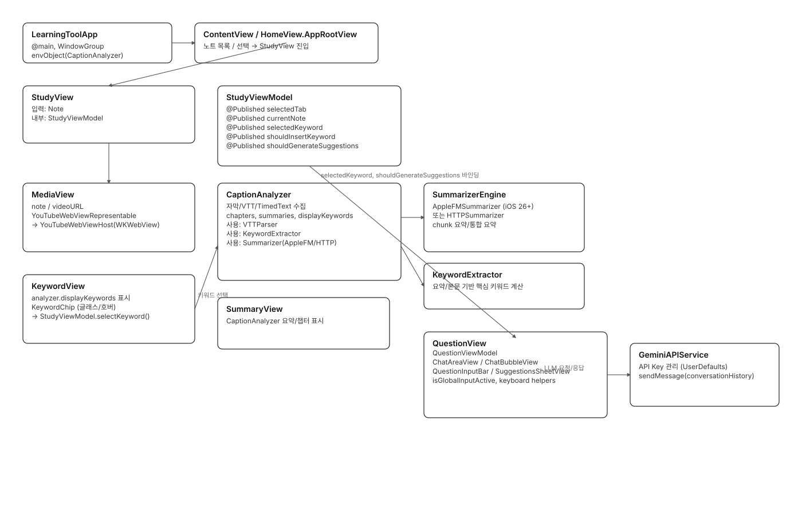
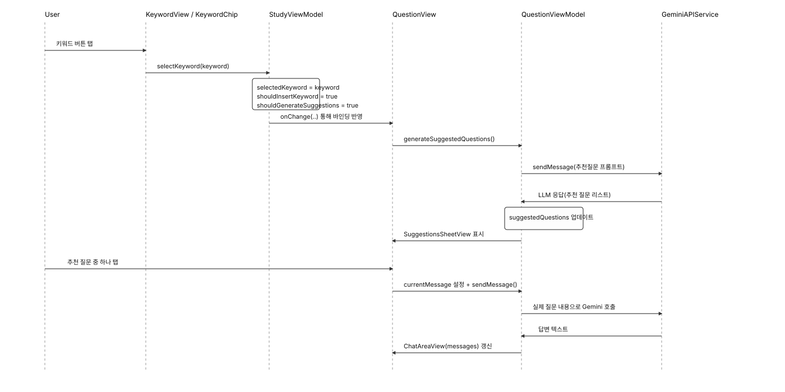
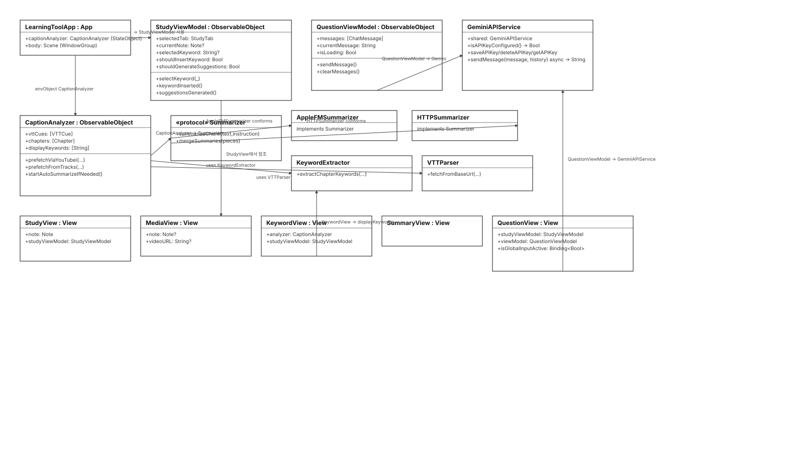

### ℹ️📋 [learningTool/AINO]
## [Logo/Cover Image]


[Dark-teal]

[Dark-purple]

[Dark-amber]


## [App statement]

아이패드로 유튜브 강의를 들으며 공부하는 대학생의 몰입이 깨지지 않도록 AI가 요약하고 핵심 키워드를 보여주면서 바로 질문할 수 있는 앱

## [App statement][Eng]

An app designed for university students studying with YouTube lectures on iPad — it helps maintain focus by using AI to summarize content, highlight key concepts, and enable instant questions without breaking immersion.


### 📞 Apple Intelligence (On-Device) Requirements
This app’s AI summarization uses Apple’s on-device foundation model (Apple Intelligence).

- **iPhone:** iPhone 16 lineup, iPhone 15 Pro/Pro Max  
- **iPad:** iPad mini (A17 Pro), iPad models with **M1 or later**  
- **Mac:** **M1 or later**  
- Make sure **Apple Intelligence is enabled** and **Siri + device language** are set to a supported language (e.g., Korean).

> On devices that don’t meet these requirements, the app may fall back to server summarization (if configured) or disable summarization.

Refs: Apple Newsroom availability notes.  [oai_citation:5‡Apple](https://www.apple.com/newsroom/2025/06/apple-elevates-the-iphone-experience-with-ios-26/)


## :framed_picture: Demo

Attach videos if you are available


<video src="https://github.com/user-attachments/assets/3f8f7ee3-317a-417a-b368-a337a972d227" width="920" controls playsinline></video>
<video src="https://raw.githubusercontent.com/<USER>/<REPO>/<BRANCH>/assets/KakaoTalk_Video_2025-10-28-17-52-00.mp4"
       width="920" autoplay loop muted playsinline></video>


## :pushpin: Features

- 영상 강의(유튜브 한정) 노트 저장
- 폴더별 노트 관리
- 강의 내용 구간별 요약
- 구간 요약시 맥락에 맞게 도출되는 주요 키워드
- 제미나이(이용자 api key 설정 후)AI를 통한 채팅 질문
- 키워드에 호버하여 빠른 채팅 입력
- 키워드 입력시 적당한 질문을 생성해주는 질문 생성 기능


## 🌿 Tree
```
.
├── learningTool
│   ├── Assets.xcassets
│   │   ├── AccentColor.colorset
│   │   │   └── Contents.json
│   │   ├── AppIcon.appiconset
│   │   │   └── Contents.json
│   │   └── Contents.json
│   ├── Components
│   │   ├── HeaderComponents.swift
│   │   ├── HelpView.swift
│   │   ├── KeywordViewComponent.swift
│   │   ├── NoteComponent.swift
│   │   └── QuestionBubbleComponent.swift
│   ├── Extensions
│   │   ├── Color+Extension.swift
│   │   ├── Font+Extension.swift
│   │   ├── View+Corners.swift
│   │   └── View+Keyboard.swift
│   ├── LearningToolApp.swift
│   ├── Models
│   │   ├── ChatMessage.swift
│   │   ├── Folder.swift
│   │   └── Note.swift
│   ├── Services
│   │   └── GeminiAPIService.swift
│   ├── ViewModels
│   │   ├── CaptionAnalyzer
│   │   │   ├── AppleFMSummarizer.swift
│   │   │   ├── CaptionAnalyzerViewModel.swift
│   │   │   ├── HTTPSummarizer.swift
│   │   │   └── Summarizer.swift
│   │   ├── ContentViewModel.swift
│   │   ├── HomeViewModel.swift
│   │   ├── QuestionViewModel.swift
│   │   ├── SidebarViewModel.swift
│   │   └── StudyViewModel.swift
│   ├── Views
│   │   ├── ContentView.swift
│   │   ├── HomeView
│   │   │   ├── CreateNoteView.swift
│   │   │   ├── FolderDeleteView.swift
│   │   │   ├── GridMode.swift
│   │   │   ├── Helpers.swift
│   │   │   ├── HomeView.swift
│   │   │   ├── ListMode.swift
│   │   │   ├── Overlay.swift
│   │   │   ├── SettingView.swift
│   │   │   ├── SidebarView.swift
│   │   │   ├── Utils
│   │   │   │   ├── KoreanSearchUtils.swift
│   │   │   │   └── NoteFormattingUtils.swift
│   │   │   └── ViewModelToggle.swift
│   │   └── StudyView
│   │       ├── ChatAreaView.swift
│   │       ├── ChatBubble.swift
│   │       ├── KeywordView.swift
│   │       ├── MediaView.swift
│   │       ├── QuestionHeaderBar.swift
│   │       ├── QuestionInputBar.swift
│   │       ├── QuestionView.swift
│   │       ├── StudyView.swift
│   │       ├── SuggestionsSheetView.swift
│   │       └── SummaryView.swift
│   └── Web
│       ├── YouTubeThumbnail.swift
│       ├── YouTubeWebViewHost.swift
│       └── YouTubeWebViewRepresentable..swift
├── learningTool.xcodeproj
│   ├── project.pbxproj
│   ├── project.xcworkspace
│   │   ├── contents.xcworkspacedata
│   │   ├── xcshareddata
│   │   │   └── swiftpm
│   │   │       └── configuration
│   │   └── xcuserdata
│   │       ├── coulson.xcuserdatad
│   │       │   └── UserInterfaceState.xcuserstate
│   │       └── mumin.xcuserdatad
│   │           └── UserInterfaceState.xcuserstate
│   └── xcuserdata
│       ├── coulson.xcuserdatad
│       │   ├── xcdebugger
│       │   │   └── Breakpoints_v2.xcbkptlist
│       │   └── xcschemes
│       │       └── xcschememanagement.plist
│       └── mumin.xcuserdatad
│           └── xcschemes
│               └── xcschememanagement.plist
├── LICENSE
└── README.md
```


## :sparkles: Skills & Tech Stack

	•	언어/런타임: Swift 5.x, Swift Concurrency(async/await, Task, @MainActor)
	•	UI: SwiftUI (NavigationSplitView, UIViewRepresentable로 WKWebView 브리지)
	•	데이터: SwiftData (@Model, ModelContext, 영속화/캐시)
	•	웹: WebKit (WKWebView, WKUserScript, WKScriptMessageHandler로 JS ↔︎ 네이티브 브릿지)
	•	요약/지능(옵션): Foundation Models 기반 요약(SystemLanguageModel 사용 가능 환경에서), 증분 요약 + 최종 병합
	•	기반 프레임워크: Foundation(네트워킹 등), OSLog(로깅)
	•	패키징: Swift Package Manager


## 📊 다이어그램

## Architecture



## Keyword → Q&A Flow



## Class Diagram



## 👥 Team

| Member | GitHub |
|---|---|
| Skyler | [](https://github.com/yulimmmm) |
| Coulson | [](https://github.com/kimminung) |
| Romak | [](https://github.com/Zunhokim) |
| Emma | [](https://github.com/hbeen0129) |
| Eifer | [](https://github.com/seungjaeyuu) |
| Moomin | [](https://github.com/namoomin) |


